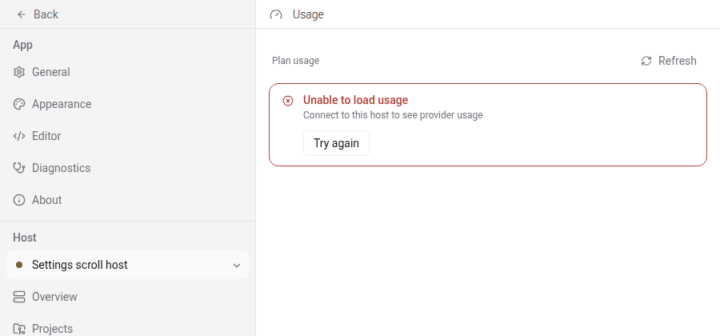
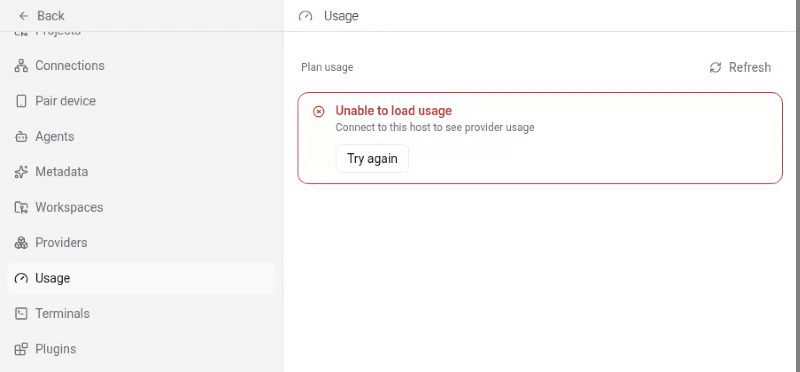

Reopening with the requested failing-before / passing-after evidence for the settings sidebar regression.

Tested PR head: `c76bcebdfef8976c37fab1b92e5fd99946c30076`

Pre-fix production source: `bb676ef086ac5d2a69486c33e5a315c2bbbd2610` (the parent of `1a894e9ac2dc9df8cff046f848df59374a3bd8bd`)

Platform: Linux (NixOS), Google Chrome `152.0.7977.82`, Playwright `1.58.2`, viewport `900x420`.

The test data is synthetic: it seeds one local-storage host named `Settings scroll host` at the intentionally unreachable endpoint `127.0.0.1:1`. No private daemon or session state is present in the screenshots or recordings.

The same regression test was used for both runs. For the before run, I kept the test/helper at the PR head and restored only `packages/app/src/screens/settings-screen.tsx` from `bb676ef086`. The resulting diff is the exact inverse of the PR's production fix. After the run, I restored the file and verified the detached worktree was clean at the PR head.

### Before: fails without the production fix

Command:

```console
git restore --source=1a894e9ac2^ -- packages/app/src/screens/settings-screen.tsx
npx playwright test --config=playwright.evidence.config.ts --project=browser e2e/browser/settings-navigation.spec.ts --grep 'keeps the scroll position across settings route boundaries'
```

Raw output:

```text
[metro] Starting project at /home/imalison/Projects/paseo/.worktrees/evidence-3506/packages/app
[metro] Using src/app as the root directory for Expo Router.
[metro] Experimental Expo Autolinking module resolver is enabled.
[metro] React Compiler enabled
[metro] Starting Metro Bundler
[metro] Waiting on http://localhost:38245
[metro] Logs for your project will appear below.
[metro] Web Bundled 2459ms packages/app/index.ts (5074 modules)
[e2e] Metro warmed on port 38245

Running 1 test using 1 worker

[metro] Web Bundled 197ms packages/app/index.ts (1 module)
[metro] Web Bundled 470ms packages/app/src/attachments/web/indexeddb-attachment-store.ts (12 modules)
  ✘  1 [browser] › e2e/browser/settings-navigation.spec.ts:164:12 › Settings sidebar scroll persistence › keeps the scroll position across settings route boundaries (15.4s)
[e2e] Metro stopped

  1) [browser] › e2e/browser/settings-navigation.spec.ts:164:12 › Settings sidebar scroll persistence › keeps the scroll position across settings route boundaries

    Error: expect(received).toBe(expected) // Object.is equality

    Expected: 377
    Received: 0

    Call Log:
    - Timeout 10000ms exceeded while waiting on the predicate

       at ../support/helpers/settings.ts:218

      216 |   expectedScrollTop: number,
      217 | ): Promise<void> {
    > 218 |   await expect
          |   ^
      219 |     .poll(() =>
      220 |       page.getByTestId("settings-sidebar-scroll-body").evaluate((element) => element.scrollTop),
      221 |     )
        at expectSettingsSidebarScrollTop (/home/imalison/Projects/paseo/.worktrees/evidence-3506/packages/app/e2e/support/helpers/settings.ts:218:3)
        at /home/imalison/Projects/paseo/.worktrees/evidence-3506/packages/app/e2e/browser/settings-navigation.spec.ts:174:5

  1 failed
    [browser] › e2e/browser/settings-navigation.spec.ts:164:12 › Settings sidebar scroll persistence › keeps the scroll position across settings route boundaries
```

The pre-fix screenshot shows that navigation reached Usage but the sidebar jumped back to the top; the assertion measured the same behavior numerically (`377 → 0`).



[Before recording](before.webm)

### After: passes at the PR head

Command:

```console
git restore --source=HEAD -- packages/app/src/screens/settings-screen.tsx
npx playwright test --config=playwright.evidence.config.ts --project=browser e2e/browser/settings-navigation.spec.ts --grep 'keeps the scroll position across settings route boundaries'
```

Raw output:

```text
[metro] Starting project at /home/imalison/Projects/paseo/.worktrees/evidence-3506/packages/app
[metro] Using src/app as the root directory for Expo Router.
[metro] Experimental Expo Autolinking module resolver is enabled.
[metro] React Compiler enabled
[metro] Starting Metro Bundler
[metro] Waiting on http://localhost:38709
[metro] Logs for your project will appear below.
[metro] Web Bundled 2443ms packages/app/index.ts (5074 modules)
[e2e] Metro warmed on port 38709

Running 1 test using 1 worker

[metro] Web Bundled 211ms packages/app/index.ts (1 module)
[metro] Web Bundled 510ms packages/app/src/attachments/web/indexeddb-attachment-store.ts (10 modules)
  ✓  1 [browser] › e2e/browser/settings-navigation.spec.ts:164:12 › Settings sidebar scroll persistence › keeps the scroll position across settings route boundaries (5.4s)
[e2e] Metro stopped

  1 passed (19.9s)
```

The post-fix frame shows Usage selected while the sidebar remains at the restored lower position.



[After recording](after.webm)

Scope covered: browser web on Linux. I did not rerun iOS, Android, or Electron for this evidence request; this regression is specifically the wide browser settings sidebar test.

Full raw outputs: [before](before.txt), [after](after.txt).
