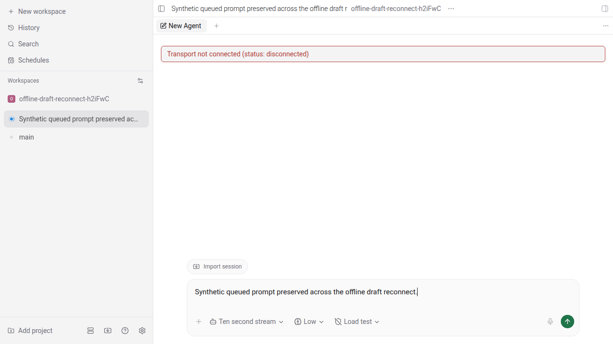
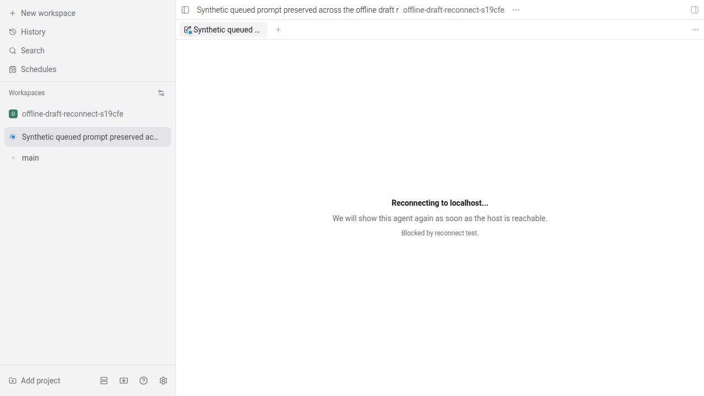
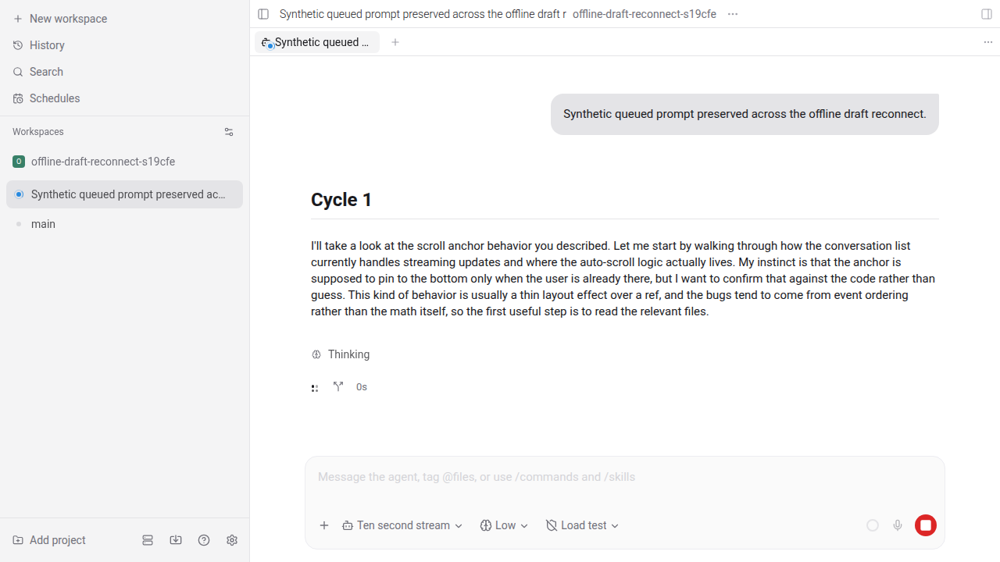

Adding the requested before/after draft UI evidence and a browser regression for draft preservation plus queued submission.

Tested live source branch head: `6510f51666d3e9a874da1a0ee33ff1357589cc55`

Pre-fix production source: `a7a708bec99e935ee4b8c6f7314a4b9a9984cfa6` (the parent of the PR's first commit, `1d07b51337`)

Platform: Linux (NixOS), Google Chrome `152.0.7977.82`, Playwright `1.58.2`, viewport `1280x720`.

The test data is synthetic. It creates an isolated temporary git repository/workspace, uses the E2E mock provider, and submits the prompt `Synthetic queued prompt preserved across the offline draft reconnect.` No private daemon, workspace, or session state is present in the screenshots or recordings. The test daemon and Metro server use isolated random ports and never connect to the developer daemon on port 6767.

While producing the evidence, the new regression found one remaining gap at the previous head `e564de4e9c`: after a live disconnect, the runtime retained its client object while marking the host disconnected, so the client-presence-only draft gate left the composer mounted. Commit `7a6edd23c6` keeps the draft unavailable state mounted until the host is actually online and adds the end-to-end regression. Follow-up `6510f51666` extracts the browser mechanics, assertions, and evidence capture into `OfflineDraftReconnectScenario`, leaving the spec as a short three-step workflow.

The test intercepts only the browser's connection to the isolated daemon. It forwards `workspace.create.response`, closes that socket, blocks reconnects, and then asserts:

- the reconnect state is visible;
- exactly one draft tab remains and the composer is not mounted;
- no `create_agent_request` was sent while offline;
- after reconnect, exactly one `create_agent_request` is sent;
- the exact queued prompt is visible, one agent tab replaces the draft tab, and no draft tab remains;
- after those recovered UI assertions, the request count is rechecked and still equals the baseline plus one.

The same regression test/helper was used for both runs. For the before run, I restored only the three production files changed by the PR from `a7a708bec9`: `use-agent-form-state.ts`, `agent-panel.tsx`, and `provider-selection.ts`. After the run, I restored the updated PR sources.

### Before: offline draft UI fails without the production fix

Command:

```console
git restore --source=1d07b513^ -- packages/app/src/hooks/use-agent-form-state.ts packages/app/src/panels/agent-panel.tsx packages/app/src/provider-selection/provider-selection.ts
env -u PASEO_PASSWORD E2E_PASEO_HOME=/tmp/paseo-pr-evidence/4261/before-refactor/home npx playwright test --config=playwright.evidence.config.ts --project=browser e2e/browser/offline-draft-reconnect.spec.ts --output=/tmp/paseo-pr-evidence/4261/before-refactor/test-results
```

Raw output:

```text
[metro] Starting project at /home/imalison/Projects/paseo/.worktrees/evidence-4261/packages/app
[metro] Using src/app as the root directory for Expo Router.
[metro] Experimental Expo Autolinking module resolver is enabled.
[metro] React Compiler enabled
[metro] Starting Metro Bundler
[metro] Waiting on http://localhost:37611
[metro] Logs for your project will appear below.
[metro] Web Bundled 2555ms packages/app/index.ts (5110 modules)
[e2e] Metro warmed on port 37611

Running 1 test using 1 worker

[e2e] Worker 0 daemon started on port 36841, home: /tmp/paseo-pr-evidence/4261/before-refactor/home/worker-0
[metro] Web Bundled 257ms packages/app/index.ts (1 module)
[metro]  LOG  [web] Logs will appear in the browser console
[metro] Web Bundled 86ms packages/app/src/attachments/web/indexeddb-attachment-store.ts (1 module)
[e2e] Worker 0 daemon stopped
  ✘  1 [browser] › packages/app/e2e/browser/offline-draft-reconnect.spec.ts:5:7 › Offline draft reconnect › preserves and submits a queued new-workspace draft once after reconnect (40.0s)
[e2e] Metro stopped

  1) [browser] › packages/app/e2e/browser/offline-draft-reconnect.spec.ts:5:7 › Offline draft reconnect › preserves and submits a queued new-workspace draft once after reconnect

    Error: expect(locator).toBeVisible() failed

    Locator: getByText('Reconnecting to localhost...', { exact: true })
    Expected: visible
    Timeout: 30000ms
    Error: element(s) not found

      42 |   async expectDraftPreservedWhileOffline(): Promise<void> {
      43 |     await expect(this.page).toHaveURL(/\/workspace\//, { timeout: 30_000 });
    > 44 |     await expect(this.page.getByText("Reconnecting to localhost...", { exact: true })).toBeVisible({
         |                                                                                        ^
      45 |       timeout: 30_000,
      46 |     });

  1 failed
    [browser] › packages/app/e2e/browser/offline-draft-reconnect.spec.ts:5:7 › Offline draft reconnect › preserves and submits a queued new-workspace draft once after reconnect
```

The pre-fix frame shows the draft composer still exposed with the error `Transport not connected (status: disconnected)` instead of the reconnect state.



[Before recording](before/offline-draft-pre-fix.webm)

### After: offline draft is preserved, then submitted once

Command:

```console
env -u PASEO_PASSWORD E2E_PASEO_HOME=/tmp/paseo-pr-evidence/4261/after-refactor/home-checkout-config npx playwright test --config=playwright.evidence.config.ts --project=browser e2e/browser/offline-draft-reconnect.spec.ts --output=/tmp/paseo-pr-evidence/4261/after-refactor/test-results-checkout-config
```

Raw output:

```text
[metro] Starting project at /home/imalison/Projects/paseo/.worktrees/evidence-4261/packages/app
[metro] Using src/app as the root directory for Expo Router.
[metro] Experimental Expo Autolinking module resolver is enabled.
[metro] React Compiler enabled
[metro] Starting Metro Bundler
[metro] Waiting on http://localhost:36137
[metro] Logs for your project will appear below.
[metro] Web Bundled 2283ms packages/app/index.ts (5110 modules)
[e2e] Metro warmed on port 36137

Running 1 test using 1 worker

[e2e] Worker 0 daemon started on port 40637, home: /tmp/paseo-pr-evidence/4261/after-refactor/home-checkout-config/worker-0
[metro] Web Bundled 240ms packages/app/index.ts (1 module)
[metro] Web Bundled 57ms packages/app/src/attachments/web/indexeddb-attachment-store.ts (1 module)
[metro]  LOG  [web] Logs will appear in the browser console
  ✓  1 [browser] › packages/app/e2e/browser/offline-draft-reconnect.spec.ts:5:7 › Offline draft reconnect › preserves and submits a queued new-workspace draft once after reconnect (12.7s)
[e2e] Worker 0 daemon stopped
[e2e] Metro stopped

  1 passed (30.2s)
```

The offline frame shows the draft tab still present while the composer is replaced by the reconnect state:



The recovered frame shows the exact queued prompt in the resulting agent session after the request count advanced by exactly one:



[After recording: offline through recovered submission](after/offline-draft-reconnect-fixed.webm)

### Commit verification

The final follow-up's pre-commit hook checked the two changed E2E files and all workspace types at `6510f51666`:

```text
All matched files use the correct format.
Finished in 72ms on 2 files using 16 threads.

Found 0 warnings and 0 errors.
Finished in 173ms on 2 files with 177 rules using 16 threads.

summary: (done in 14.12 seconds)
✓ format (0.29 seconds)
✓ lint (0.34 seconds)
✓ typecheck (14.10 seconds)
```

Scope covered: browser web on Linux, including a real isolated daemon connection and real reconnect path. I did not rerun iOS, Android, or Electron for this evidence request.
